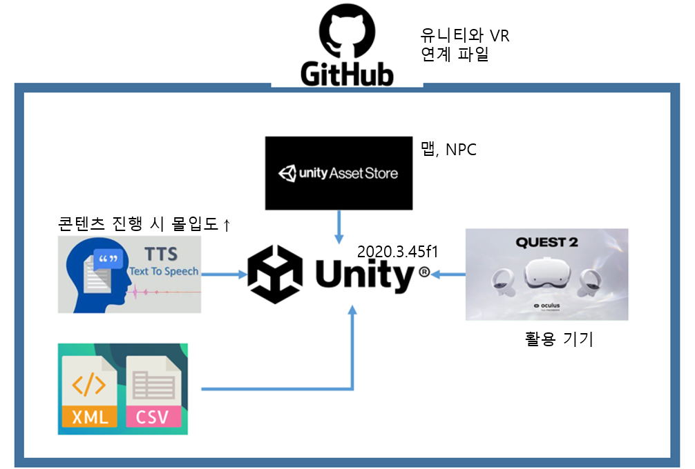
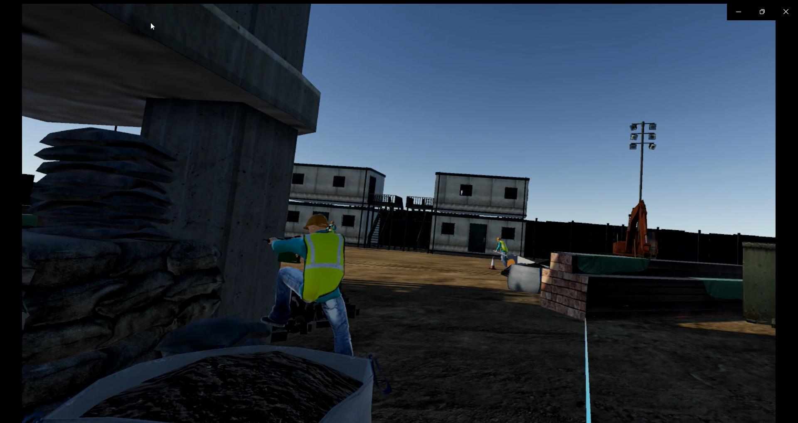
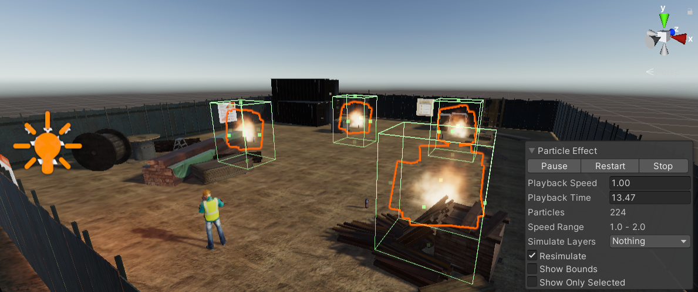
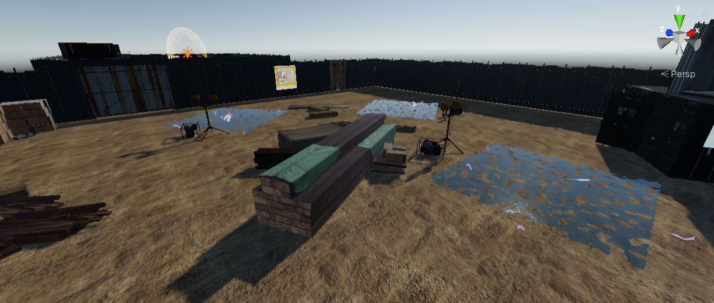
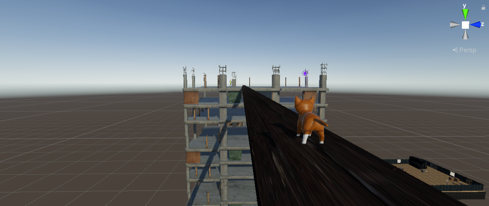

# VRArchitecturalExperienceProgram

### VR 건축 체험 프로그램 (박지인, 송승훈, 유재은)

### 실행환경 : Unity

</img>

## 실행방법
1. Oculus VR 장비와 PC를 A -> C타입 케이블로 연결, PC의 Oculus앱을 이용하여 VR 장비와 PC 연결 확인 (VR 장비의 기본적인 세팅 완료 
   후)
2. 공유한 프로젝트 파일을 유니티(2020.3.45f1)에서 실행
3. Oculus VR 장비 착용 후 빠른 설정 클릭, Quset Link 활성화 (PC와 같은 네트워크에 연결되어야 함)
4. 오른쪽 아래에 모니터 버튼을 클릭, VR 장비에서 PC의 화면이 잘 나오는지 확인 (PC의 그래픽카드가 gtx 1060 이상이어야 함)
5. PC의 마우스나 VR 컨트롤러를 이용해서 유니티의 플레이 버튼 클릭
6. VR 컨트롤러를 이용해서 눈 앞에 보이는 start 버튼 클릭(MainMenu 씬) 후 공사장으로 이동
7. VR 컨트롤러를 이용해서 캐릭터 이동, 맵에 있는 포탈에 가까이 가면 캐릭터가 각 현장에 맞는 곳으로 이동함 (빨강 - 화재, 파랑 - 감전, 
   보라 - 추락)
   
#8-1. 화재 - 빨간 포탈을 타면 화재 현장으로 이동함. 현장에는 화재로인한 불이 타오르고 있음. 만약 플레이어가 불에 닿으면 플레이어는 포탈 입구로 이동함. 플레이어는 VR 컨트롤러를 이용해 근처 소화기를 잡고 움직일 수 있음. 플레이어가 소화기를 불과 접촉시키면 불이 사라짐.

#8-2. 감전 - 파란 포탈을 타면 감전 현장으로 이동함. 현장에는 곳곳에 전기가 흐르는 물 웅덩이와 웅덩이 근처 기계 장비가 있음. 만약 플레이어가 전기가 흐르는 물에 닿을 시 포탈 입구로 이동함. 플레이어는 기계 장비와 접촉해서 웅덩이에 흐르는 전기를 차단해야함.

#8-3. 추락 - 보라 포탈을 타면 추락 현장으로 이동함. 플레이어는 높은 고층 건물 사이를 잇는 나무 다리에 있는 고양이를 구출해야함. 만약 플레이어가 떨어지면 포탈 입구로 이동함. 플레이어는 VR 컨트롤러를 이용해서 고양이를 잡고 다리 건너편까지 안전하게 이동해야함.
   
</img>

#화재 진압

#화재 사고 맵에서 불 이펙트에 Box Collider를 넣어서 플레이어가 접근 시 벽에 가로막히도록 하였다. 만약 플레이어가 Box Collider에 부딪히게 된다면, 플레이어는 경고 문구와 함께 화재 사고 맵 포탈의 앞으로 이동하게 된다.
플레이어는 불 이펙트 앞에 놓여있는 소화기에 상호작용을 하면, 소화기에서 하얀 연기가 나오며, 불 이펙트가 사라지게 된다. 플레이어는 화재 사고 맵에 있는 4개의 모든 불 이펙트를 제압해야 한다.

</img>

#감전 사고
 
#감전 사고 맵에서 전기 이펙트에 Box Collider를 넣어서 플레이어가 접근 시 벽에 가로막히도록 하였다. 만약 플레이어가 Box Collider에 부딪히게 된다면, 플레이어는 경고 문구와 함께 감전 사고 맵 포탈의 앞으로 이동하게 된다.
플레이어는 물웅덩이 근처에 놓여있는 발전기에 상호작용을 하면, 발전기가 종료되며 전기 이펙트가 사라지게 된다. 플레이어는 감전 사고 맵에 있는 3개의 모든 발전기를 종료해야 한다. 플레이어가 발전기를 종료한 후, 전기 이펙트가 사라진 물웅덩이에 진입하여도, 플레이어는 포탈 앞으로 이동하지 않는다.

</img>

#추락 사고

#추락 사고 맵에서 플레이어는 고층 건설 작업장 사이에 있는 다리를 건너며, 다리 중앙에 놓여있는 고양이를 구출해야한다. 플레이어가 고양이에게 다가갈 시 고양이가 한 번 도망치며, 이 때 다리가 흔들리게 된다. 플레이어가 고양이를 데리고 다리를 완전히 건너면 성공이다.

</img>

#NPC 대사

#플레이어가 포탈을 타고 이동할 때마다 NPC가 그 현장에 맞는 대사를 한다. 현장에서 어떻게 사고를 예방할 수 있는지, 사고가 발생했을 때 어떻게 대처하는 지에 대해서 알려준다.

##공동 개발 제작자
-박지인
-송승훈
-유재은
